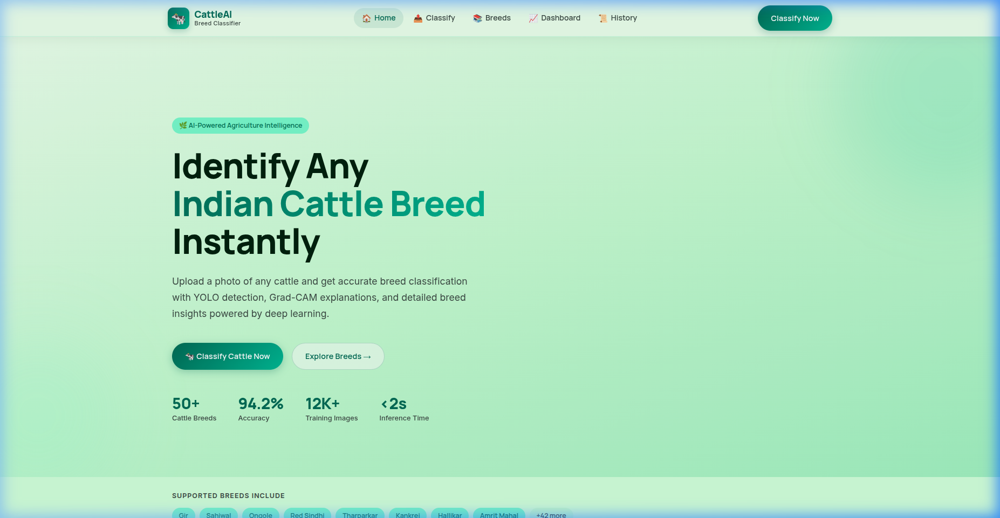
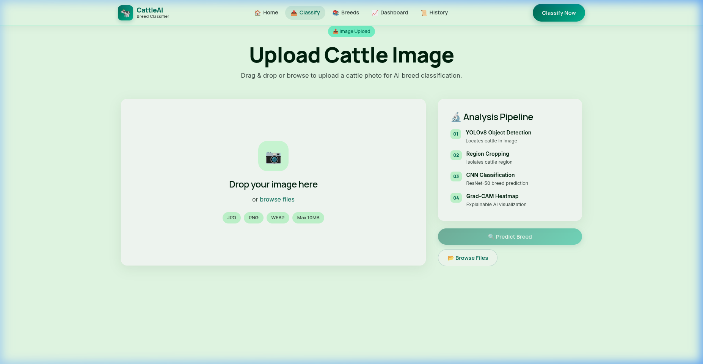
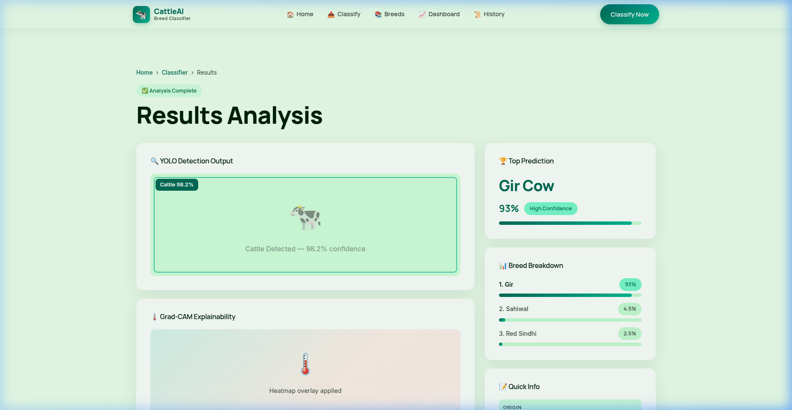
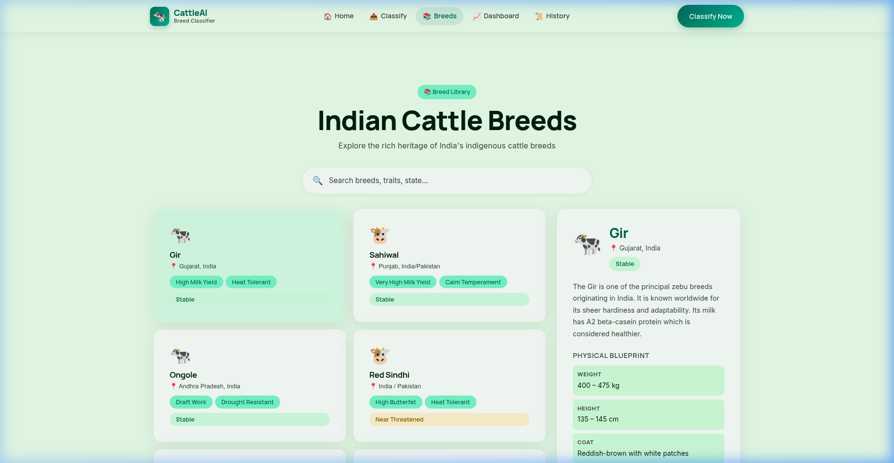
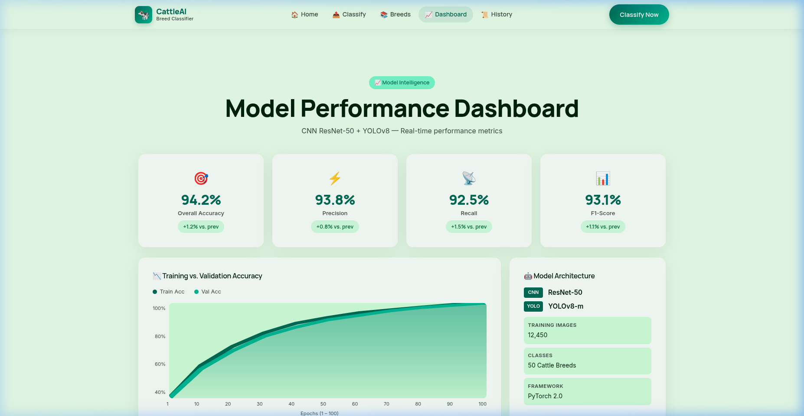
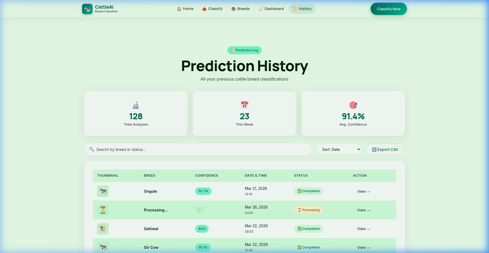

# 🐄 Cattle Breed Classifier SPA

> **AI-Powered Image-Based Breed Classification of Indian Cattle**  
> CNN (ResNet-50) + YOLOv8 · Grad-CAM XAI · React + Vite Frontend

[](https://reactjs.org/)
[](https://vitejs.dev/)
[](LICENSE)
[](https://stitch.withgoogle.com/)

---

## 📋 Table of Contents

- [Overview](#-overview)
- [UI Screenshots](#-ui-screenshots)
- [Features](#-features)
- [Tech Stack](#-tech-stack)
- [Getting Started](#-getting-started)
- [Project Structure](#-project-structure)
- [Pages](#-pages)
- [Design System](#-design-system)
- [Roadmap](#-roadmap)

---

## 🌿 Overview

The **Cattle Breed Classifier SPA** is a modern, AI-powered web application for identifying and classifying Indian cattle breeds from photographs. It combines a **YOLOv8 object detector** to locate cattle in an image with a **CNN (ResNet-50) classifier** to predict the breed with confidence scores.

The interface was designed using **Google Stitch** (AI UI generation) with the "Digital Pasture" design aesthetic — a premium glassmorphism theme inspired by the agricultural landscape.

---

## 📸 UI Screenshots

### 🏠 Home Page  
Hero section with key stats (94.2% accuracy), breed tags, feature cards, and a CTA button.



---

### 📤 Upload & Classify Page  
Drag-and-drop upload zone with image preview, 4-step pipeline sidebar, and animated progress bar.



---

### 📊 Results Page  
YOLO bounding-box visualization, Grad-CAM heatmap explainability, breed confidence breakdown, and quick-info panel.



---

### 📚 Breed Library  
Searchable grid of Indian cattle breeds with detailed information panel — origin, milk yield, physical characteristics, conservation status.



---

### 📈 Model Performance Dashboard  
KPI cards (Accuracy 94.2%, Precision, Recall, F1), interactive training/validation accuracy SVG chart, breed-wise accuracy bars, and confusion matrix heatmap.



---

### 📜 Prediction History  
Searchable, sortable table of all past predictions with status badges, timestamps, and CSV export functionality.



---

## ✨ Features

| Feature | Status |
|---|---|
| 🖼️ Image Upload (Drag & Drop + Browse) | ✅ Implemented |
| 🔍 YOLOv8 Cattle Detection Visualization | ✅ UI Ready |
| 🤖 CNN Breed Classification (ResNet-50) | ✅ UI Ready |
| 📊 Confidence Score Display | ✅ Implemented |
| 🌡️ Grad-CAM Heatmap Explainability | ✅ UI Ready |
| 📚 Breed Information Library (6+ breeds) | ✅ Implemented |
| 📈 Model Performance Dashboard | ✅ Implemented |
| 📜 Prediction History Log | ✅ Implemented |
| ⬇️ Export CSV | ✅ Implemented |
| 📱 Responsive Design | ✅ Implemented |
| 🔗 Backend API Integration | 🔄 Planned |

---

## 🛠️ Tech Stack

### Frontend
| Technology | Version | Purpose |
|---|---|---|
| **React** | 19.x | UI Framework |
| **React Router DOM** | 7.x | Client-side Routing |
| **Vite** | 5.x | Build Tool & Dev Server |
| **Vanilla CSS** | — | Styling (Design System) |
| **Google Fonts** | Manrope + Inter | Typography |
| **Google Stitch** | — | AI UI Design Generation |

### Planned Backend (Phase 2)
| Technology | Purpose |
|---|---|
| **Flask / FastAPI** | REST API (`/predict` endpoint) |
| **PyTorch** | CNN ResNet-50 model |
| **Ultralytics YOLOv8** | Object detection |
| **Grad-CAM** | Explainability heatmaps |

---

## 🚀 Getting Started

### Prerequisites
- Node.js ≥ 18.x
- npm ≥ 9.x

### Installation

```bash
# Clone the repository
git clone https://github.com/punithkrishnakeepudi/Cattle-Breed-Classifier-ml-.git
cd Cattle-Breed-Classifier-ml-

# Install dependencies
npm install

# Start development server
npm run dev
```

The app will be available at **http://localhost:5173**

### Build for Production

```bash
npm run build
npm run preview
```

---

## 📁 Project Structure

```
hemanth-prj/
├── public/
│   └── screenshots/          # UI preview screenshots
├── src/
│   ├── components/
│   │   ├── Navbar.jsx         # Glassmorphic sticky navigation
│   │   └── Navbar.css
│   ├── pages/
│   │   ├── HomePage.jsx       # Landing page with hero & features
│   │   ├── HomePage.css
│   │   ├── UploadPage.jsx     # Image upload & classification
│   │   ├── UploadPage.css
│   │   ├── ResultPage.jsx     # Prediction results display
│   │   ├── ResultPage.css
│   │   ├── BreedsPage.jsx     # Breed information library
│   │   ├── BreedsPage.css
│   │   ├── DashboardPage.jsx  # Model performance metrics
│   │   ├── DashboardPage.css
│   │   ├── HistoryPage.jsx    # Prediction history log
│   │   └── HistoryPage.css
│   ├── App.jsx                # Router configuration
│   ├── main.jsx               # Entry point
│   └── index.css              # Global design system
├── docs/
│   └── todo.md                # Project roadmap
├── index.html
├── package.json
├── vite.config.js
└── README.md
```

---

## 📄 Pages

| Route | Page | Description |
|---|---|---|
| `/` | Home | Hero section, features overview, stats, breed preview |
| `/upload` | Classify | Drag-drop upload, pipeline explanation, predict button |
| `/result` | Results | Detection output, Grad-CAM, confidence scores, breed info |
| `/breeds` | Breed Library | Searchable breed catalog with detailed info panel |
| `/dashboard` | Dashboard | Accuracy metrics, training chart, confusion matrix |
| `/history` | History | Past predictions with search, sort, and CSV export |

---

## 🎨 Design System

The UI follows the **"Digital Pasture"** design language:

| Token | Value | Use |
|---|---|---|
| `--primary` | `#006b55` | Buttons, headings, key text |
| `--primary-container` | `#00b894` | Gradient end, chips |
| `--secondary-container` | `#78f9cc` | Confidence badges |
| `--surface` | `#e9ffeb` | Page background |
| `--surface-container-lowest` | `#ffffff` | Cards (white) |
| Font Display | **Manrope** | Headings, nav |
| Font Body | **Inter** | Paragraphs, labels |
| Border Radius | `8px / 12px / 16px / 24px` | Progressive rounding |

Key principles:
- ✅ **Glassmorphism** — `backdrop-filter: blur(14px)` on all cards/nav
- ✅ **No hard borders** — only tonal background shifts for sections
- ✅ **Ambient shadows** — `0 8px 40px rgba(0,33,14,0.10)`
- ✅ **Interactive glows** — `rgba(120,249,204,0.3)` on hover

---

## 🗺️ Roadmap

### ✅ Phase 1 — Frontend UI (Complete)
- [x] React + Vite project setup
- [x] Design system ("Digital Pasture" theme)
- [x] Home page
- [x] Upload & Predict page
- [x] Results page
- [x] Breed Information library
- [x] Model Dashboard
- [x] Prediction History

### 🔄 Phase 2 — Model Building (Upcoming)
- [ ] Download & clean Kaggle dataset (50+ breeds)
- [ ] Train CNN ResNet-50 (PyTorch)
- [ ] Train YOLOv8 object detector
- [ ] Implement Grad-CAM explainability
- [ ] End-to-end hybrid pipeline

### 🔄 Phase 3 — Backend & Deployment  
- [ ] Flask/FastAPI `/predict` endpoint
- [ ] Frontend ↔ Backend API integration
- [ ] Cloud deployment

---

## 👥 Contributors

| Name | Role |
|---|---|
| **Hemanth** | ML Engineer, Project Lead |
| **Punith** | Frontend Developer |

---

## 📄 License

This project is licensed under the **MIT License** — see [LICENSE](LICENSE) for details.

---

<div align="center">
  <p>Made with ❤️ for Indian Agriculture</p>
  <p>🐄 Classify · 🧠 Understand · 📊 Improve</p>
</div>
